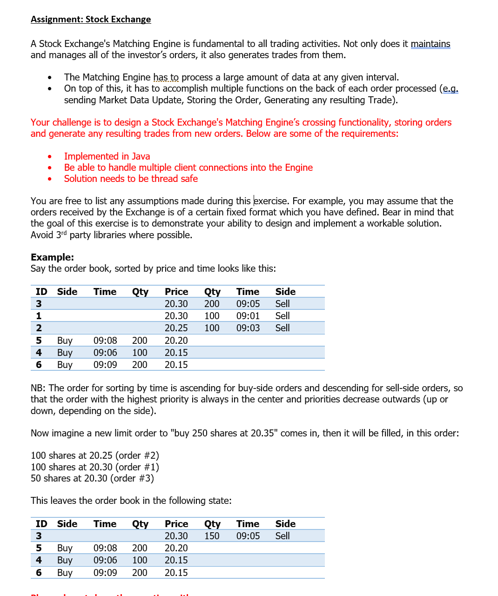
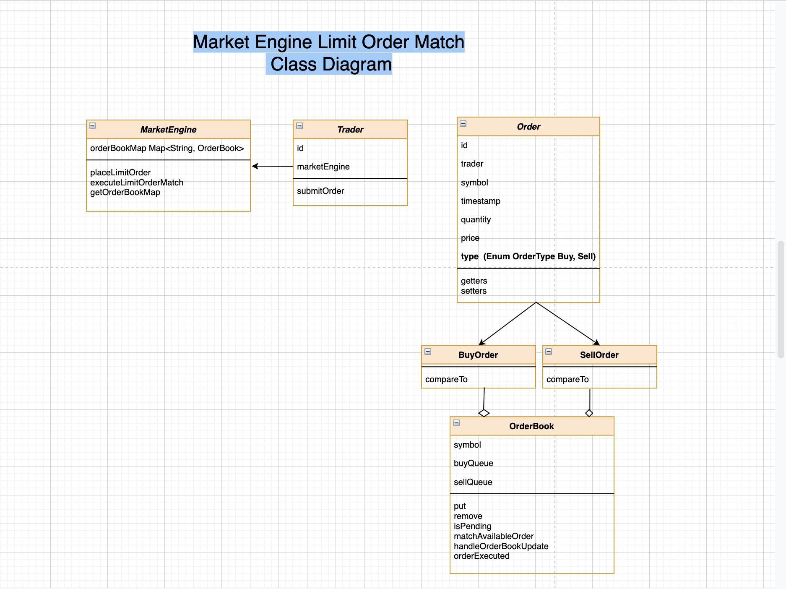

# Stock Exchange - LimitOrder Implementation

## Problem Statement -

## Implementation Details -

# Assumptions
* Program will support all symbols but in test execution is only for symbols start with A char. because for performance
  assumption is every alphabetic letter will have a separate Market Engine instance.
* Test data is hardcoded but in real application we can extend to load from Database.  
* Market Engine will be Singleton object per Alphabets.  
  

# Functional Specifications- 

1. The Market Engine.
The matching engine logic will be called when incoming orders are received. The basic logic will be as follows:

- On Application startup- Market engine will load all the available orders from DB.
- Market Engine is allowing to take new order in order book. 
- Market Engine is responsible to execute Limit Order Match.

2. The Order Book. 
OrderBook of one symbol consists of sell and buy orders in two different priority queues. 
   - This implementation uses a concurrentMap object. The keys of the map will be symbol and value will be Orderbook Object.
   - Queues allow us to maintain order priority, meaning first in first out at each price level. 
     The queue will make the matching engine's job easier in determining which order to fill first. 

ConcurrentHashMap Orderbook <symbol, Orderbook >

This data structure will provide a thread safe collection to hold multiple orders at multiple price levels. 
It will be the matching engine's job to parse the Map appropriately and match orders.   

PriorityBlockingQueue -
PriorityBlockingQueue is used for store buy and sell orders in order book in priority and also provide thread safety.

.

## Main Classes 
Class Diagram - 

* Order : Base class for buyOrder and sellOrder including order that specifies "thing", quantity and price. 
* BuyOrder: Comparator that sorts buy orders by (1) descending price (2) increasing time stamps
* SellOrder: Comparator that sorts sell orders by (1) increasing price (2) increasing time stamps.
* OrderType: Enum to keep buy and sell Order types.
* Trader: represents clients that submit buy and sell orders to the order book

## Prerequisites to run the Demo
* Java
* Maven
* Git

## Run the Demo

- Clone the repo to some directory
- cd into the directory
- run Maven